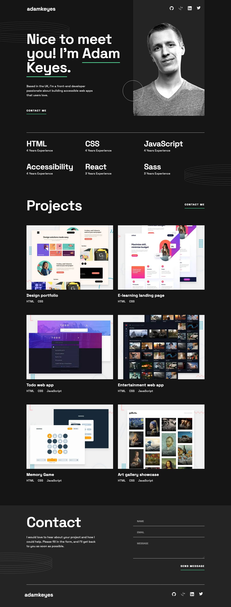

# Single-page developer portfolio solution

This is a solution to the [Single-page developer portfolio challenge on Frontend Mentor](https://www.frontendmentor.io/challenges/singlepage-developer-portfolio-bBVj2ZPi-x). Frontend Mentor challenges help you improve your coding skills by building realistic projects.

| [Live Demo URL](https://ionstici.github.io/single-page-developer-portfolio) | [Frontend Mentor](https://www.frontendmentor.io/solutions/singlepage-developer-portfolio-fB2Sp740mw) |
| --------------------------------------------------------------------------- | ---------------------------------------------------------------------------------------------------- |

## Screenshot



## Built with

- Semantic HTML5 markup
- CSS custom properties
- Flexbox and CSS Grid
- Sass (Scss)
- Mobile-first workflow
- JavaScript and Form validation

## Getting Started

```bash
git clone https://github.com/ionStici/single-page-developer-portfolio.git
cd single-page-developer-portfolio
live-server
# Open at localhost:8000
```

## Acknowledgements

[Frontend Mentor](https://www.frontendmentor.io) for providing the challenge. You you're looking to improve your frontend coding skills, there is no better solution than practicing on your own.
