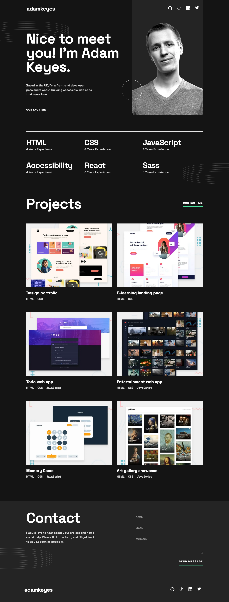

# Single-page developer portfolio solution

This is a solution to the [Single-page developer portfolio challenge on Frontend Mentor](https://www.frontendmentor.io/challenges/singlepage-developer-portfolio-bBVj2ZPi-x).

## Table of contents

-   [Screenshot](#screenshot)
-   [Links](#links)
-   [Built with](#built-with)
-   [Author](#author)

## Screenshot

## Links

-   [Solution URL](https://github.com/ionStici/single-page-developer-portfolio)
-   [Live Site URL](https://ionstici.github.io/single-page-developer-portfolio)

## Built with

-   Semantic HTML5 markup
-   CSS custom properties
-   Flexbox and CSS Grid
-   Sass (Scss)
-   Mobile-first workflow
-   JavaScript and Form validation

## Author

-   [GitHub](https://github.com/ionStici)
-   [Frontend Mentor](https://www.frontendmentor.io/profile/ionStici)
-   [Twitter](https://twitter.com/ionStici_)
